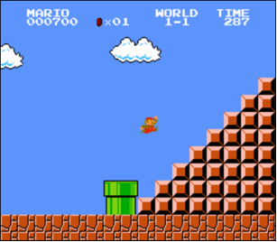

# Mario 🧑🏽‍🔧

## Problem to Solve

Toward the end of World 1-1 in Nintendo’s Super Mario Bros., Mario must ascend right-aligned pyramid of bricks, as in the below.

<p align="center">
    
</p>

In a file called `mario.c` in a folder called `mario-less`, implement a program in C that recreates that pyramid, using hashes (`#`) for bricks, as in the below:

```
       #
      ##
     ###
    ####
   #####
  ######
 #######
########
```

But prompt the user for an `int` for the pyramid’s actual height, so that the program can also output shorter pyramids like the below:

```
  #
 ##
###
```

Re-prompt the user, again and again as needed, if their input is not greater than 0 or not an `int` altogether.
